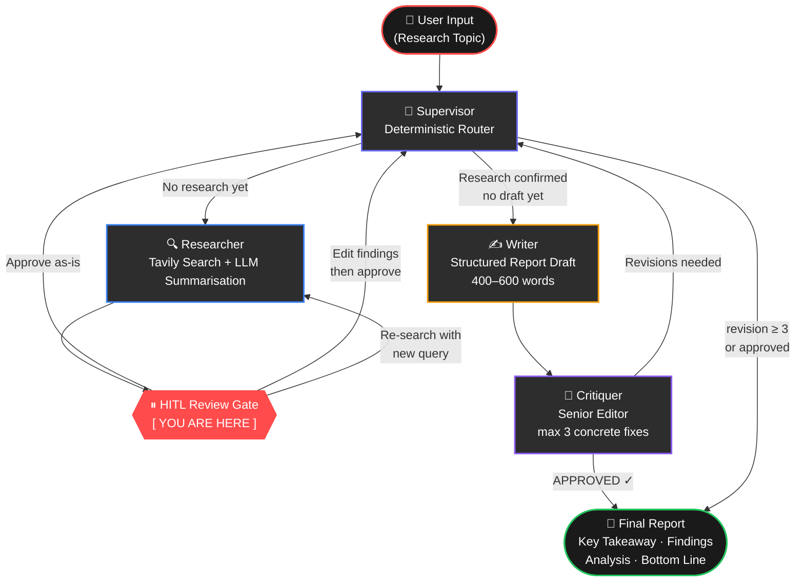
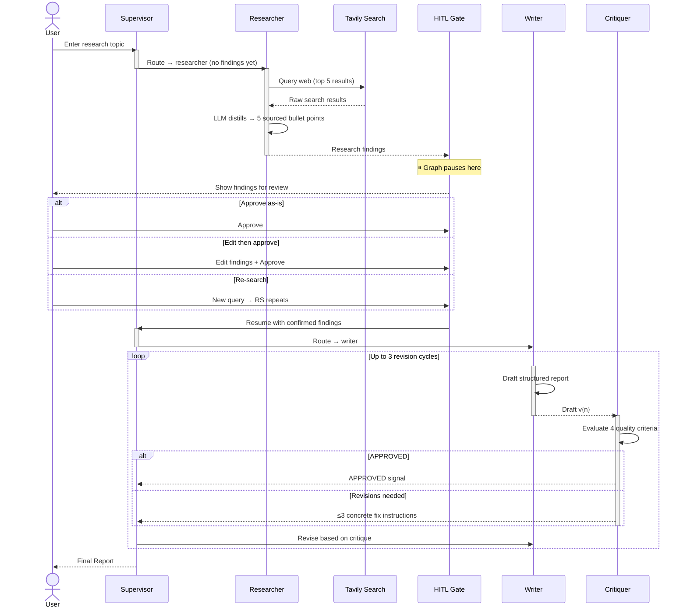

<div align="center">

# Polyagentic Research Assistant

**A stateful multi-agent AI system that transforms any research topic into a structured, sourced report — autonomously.**

[](https://python.org)
[](https://langchain-ai.github.io/langgraph/)
[](https://python.langchain.com/)
[](https://streamlit.io)
[](https://groq.com)
[](https://ollama.com)
[](./tests)
[](./LICENSE)

<br/>

*Four specialized agents. One human checkpoint. Zero garbage output.*

</div>

---

## Overview

Most LLM "research" tools are single-prompt wrappers. This is different.

**Polyagentic Research Assistant** implements a proper multi-agent workflow using [LangGraph](https://langchain-ai.github.io/langgraph/) — a stateful graph engine with real checkpointing. Five agents collaborate in a supervised loop: a **Supervisor** orchestrates routing, a **Researcher** queries the live web, a **Writer** drafts structured reports, and a **Critiquer** enforces quality through iterative revision.

The critical design choice: a **Human-in-the-Loop gate** sits at the research boundary. Before any writing begins, you review and optionally edit the raw findings. This single intervention prevents the "garbage in, garbage out" problem that makes fully-automated research tools unreliable.

---

## Architecture

### Agent Pipeline



---

### Execution Sequence



---

## Agents

| # | Agent | Responsibility | Key Design |
|---|-------|---------------|------------|
| 01 | **Supervisor** | Central router — decides which agent acts next | Deterministic state-based rules first; LLM fallback only when logic is ambiguous. Prevents routing failures. |
| 02 | **Researcher** | Web search + LLM summarisation | Queries Tavily (live web), distills to exactly 5 sourced bullet points. Source URLs preserved inline. |
| 03 | **HITL Review Gate** | Human checkpoint — pause, review, edit, or redirect | Implemented as a LangGraph `interrupt_before` node. State is checkpointed — the graph can resume after human input. |
| 04 | **Writer** | Structured report generation and revision | Enforces `Key Takeaway → Findings → Analysis → Bottom Line` schema. Revises against critiquer notes. |
| 05 | **Critiquer** | Quality gate — approve or return concrete fixes | Evaluates 4 criteria: relevance, source fidelity, substance, structure. Approves at 80% quality. Returns max 3 actionable fixes (not vague advice). |

---

## Key Design Decisions

### Deterministic routing first, LLM fallback second
The Supervisor evaluates workflow state with hardcoded rules before ever calling the LLM. If critique says `APPROVED` and a draft exists → route to `END`. If no research exists → route to `researcher`. This eliminates an entire class of failures caused by LLM JSON parsing errors or hallucinated route decisions.

### Single HITL gate at the research boundary
There is exactly **one** human checkpoint: after research, before writing. This is the highest-leverage intervention point. Bad source material propagates through every downstream step — writing, critique, and revision can't fix fundamentally wrong facts. One early review prevents wasted compute cycles.

### Append-only research findings
`research_findings` uses `Annotated[List[str], operator.add]` in the TypedDict state. Findings **accumulate** across research cycles rather than being overwritten. Re-searching appends to the pool, preserving prior context.

### Hard revision cap
Maximum 3 critique → writer cycles. The Critiquer prompt is tuned to approve at 80% quality and cap feedback at 3 concrete, scoped instructions — making the automated loop reliable enough to run without further human intervention.

### Dual LLM provider support
Users switch between **Groq** (cloud, fast) and **Ollama** (local, private) at runtime via the sidebar. The `_get_llm()` factory handles instantiation and falls back gracefully on failure. No API key required in Ollama mode.

---

## Tech Stack

| Layer | Technology | Purpose |
|-------|------------|---------|
| **Orchestration** | [LangGraph](https://langchain-ai.github.io/langgraph/) `StateGraph` | Stateful agent workflow with `MemorySaver` checkpointing |
| **LLM Framework** | [LangChain](https://python.langchain.com/) | Chain construction, prompt templates, LLM abstraction |
| **Cloud LLM** | [Groq](https://groq.com/) | Ultra-fast inference — `llama-3.3-70b`, `mixtral-8x7b`, `gemma2-9b` |
| **Local LLM** | [Ollama](https://ollama.com/) | Self-hosted inference, any model |
| **Web Search** | [Tavily Search API](https://tavily.com/) | Real-time web research with structured results |
| **Frontend** | [Streamlit](https://streamlit.io/) | Custom Brutalist UI with CSS design system |
| **Package Manager** | [uv](https://docs.astral.sh/uv/) | Fast Python package management |
| **Testing** | [pytest](https://pytest.org/) | 55 unit tests, 100% offline (all LLM calls mocked) |

---

## Project Structure

```
polyagentic-research-assistant/
│
├── app.py                    # Streamlit entry point — state-machine UI router
├── graph.py                  # LangGraph StateGraph — nodes, edges, compilation
├── agents.py                 # Agent factory functions + dynamic LLM provider
├── prompts.py                # All prompt templates (supervisor, writer, critiquer)
│
├── ui/
│   ├── __init__.py
│   ├── style.py              # Brutalist CSS design system (variables, components)
│   ├── sidebar.py            # Sidebar config — LLM provider, model, iterations
│   ├── state.py              # Session state initialisation + API key validation
│   └── stream_handler.py     # Live agent log, pipeline header, header downgrader
│
├── tests/
│   ├── test_agents.py        # 35 tests — all agent chains, LLM factory, error paths
│   ├── test_graph.py         # 16 tests — graph nodes, routing, state schema
│   └── test_tools.py         # 4 tests — LLM compatibility helper (_call_llm)
│
├── docs/
│   ├── high_level_design.md  # Architecture overview and design decisions
│   └── low_level_design.md   # Node-by-node implementation details
│
├── .env.example              # Environment variable template
├── pyproject.toml            # Project config + pytest settings
└── requirements.txt          # Pip-installable dependencies
```

---

## Setup

### Prerequisites

- Python 3.11+
- A [Groq API key](https://console.groq.com/) — free, no credit card required
- A [Tavily API key](https://tavily.com/) — free tier: 1,000 searches/month
- *(Optional)* [Ollama](https://ollama.com/) running locally for private inference

### Installation

```bash
# Clone the repository
git clone https://github.com/virtualvasu/polyagentic-research-assistant.git
cd polyagentic-research-assistant

# Install with uv (recommended — significantly faster than pip)
pip install uv
uv pip install -r requirements.txt

# Or with standard pip
pip install -r requirements.txt
```

### Environment Configuration

```bash
cp .env.example .env
```

Edit `.env`:

```env
# Required
GROQ_API_KEY=gsk_...
TAVILY_API_KEY=tvly-...

# Optional — only needed if using Ollama local inference
OLLAMA_BASE_URL=http://localhost:11434
OLLAMA_MODELS=llama3.1:latest,llama3.1:8b,qwen2.5:7b
```

### Run

```bash
streamlit run app.py
```

Open [http://localhost:8501](http://localhost:8501).

---

## Using Ollama (Local Inference)

Run research entirely offline — no Groq key required (Tavily key still needed for web search).

```bash
# Pull a model
ollama pull llama3.1:latest

# Or smaller, faster option
ollama pull qwen2.5:7b
```

In the Streamlit sidebar, switch **LLM Provider → Ollama** and select your pulled model. The `_get_llm()` factory handles the rest.

---

## Running Tests

All 55 tests run **fully offline** — every LLM and Tavily call is mocked with `unittest.mock`.

```bash
# Using the pyenv Python that has all dependencies
/home/netweb/.pyenv/versions/3.11.14/bin/python -m pytest tests/ -v

# Or if your env is set up correctly
pytest tests/ -v
```

**Test coverage breakdown:**

| File | Tests | What's covered |
|------|-------|----------------|
| `test_agents.py` | 35 | `_call_llm`, `_get_llm`, Supervisor routing (all branches), Researcher (search, errors, edge cases), Writer (HITL path, error propagation), Critiquer (approve/reject/max-revisions) |
| `test_graph.py` | 16 | Graph compilation, all 5 node functions, state transitions, `ResearchState` schema validation |
| `test_tools.py` | 4 | LLM compatibility helper (invoke/run/callable fallback chain) |

---

## Workflow Walkthrough

```
1. Enter topic    →  "Post-quantum cryptography adoption timeline"
2. Supervisor     →  Routes to Researcher (no findings in state)
3. Researcher     →  Queries Tavily, LLM condenses to 5 sourced bullets
4. [ YOU ]        →  Review findings. Edit if needed. Approve or re-search.
5. Supervisor     →  Routes to Writer (findings confirmed by human)
6. Writer         →  Produces: Key Takeaway / Findings / Analysis / Bottom Line
7. Critiquer      →  Evaluates 4 quality criteria — approves or returns ≤3 fixes
8. Loop           →  Writer revises, Critiquer re-evaluates (max 3 cycles)
9. Final Report   →  Displayed with word count, revision stats, download button
```

---

## Sidebar Configuration

| Setting | Default | Description |
|---------|---------|-------------|
| Max Iterations | 15 | LangGraph recursion limit — prevents infinite loops |
| LLM Provider | Groq | Switch between Groq (cloud) and Ollama (local) at runtime |
| Model | `llama-3.3-70b-versatile` | Applied to all agent chains simultaneously |
| Ollama Host | `http://localhost:11434` | Only shown when Ollama is selected |

---

## Roadmap

- [ ] **Persistent checkpoints** — replace `MemorySaver` with `SqliteSaver` for cross-session history
- [ ] **RAG mode** — ChromaDB integration for querying user-uploaded documents alongside web search
- [ ] **Evaluation agent** — automated report scoring on source fidelity, coverage, and conciseness
- [ ] **FastAPI backend** — decouple agent workflow from frontend, expose REST API with Swagger docs
- [ ] **LangSmith integration** — full trace observability, token usage, and latency dashboards
- [ ] **HuggingFace Spaces deployment** — live public demo

---

## License

MIT — see [LICENSE](./LICENSE) for details.

---

<div align="center">

Built with [LangGraph](https://langchain-ai.github.io/langgraph/) · [LangChain](https://python.langchain.com/) · [Groq](https://groq.com/) · [Streamlit](https://streamlit.io/)

</div>
