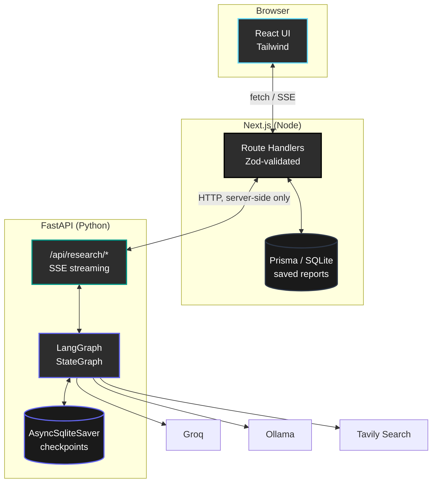
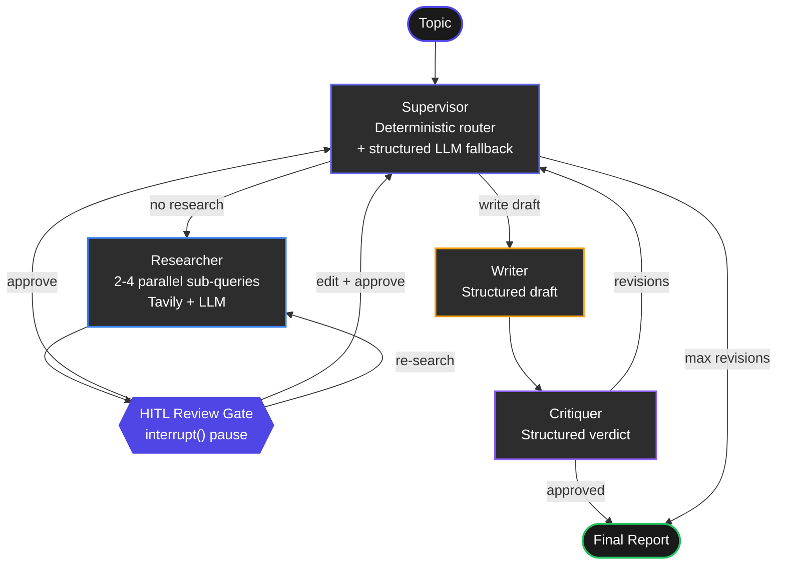

<div align="center">

# Polyagentic Research Assistant

**A stateful multi-agent AI system that transforms any research topic into a structured, sourced report — autonomously.**

<br>

<a href="https://huggingface.co/spaces/virtualvasu/multi-agent-research-assistant">
  
</a>

<br>
<br>

[](https://nextjs.org)
[](https://react.dev)
[](https://www.typescriptlang.org/)
[](https://tailwindcss.com)
[](https://www.prisma.io)
[](https://fastapi.tiangolo.com)
[](https://langchain-ai.github.io/langgraph/)
[](https://groq.com)
[](https://ollama.com)
[](./backend/tests)
[](./LICENSE)

<br/>

*Five specialized agents. One human checkpoint. A typed contract at every boundary.*

</div>

---

## Overview

Most LLM "research" tools are single-prompt wrappers. This is different.

**Polyagentic Research Assistant** runs a proper multi-agent workflow on [LangGraph](https://langchain-ai.github.io/langgraph/) — a stateful graph engine with real, crash-safe checkpointing. A **Supervisor** routes deterministically between agents, a **Researcher** decomposes a topic into parallel sub-queries and searches the live web, a **Writer** drafts structured reports, and a **Critiquer** enforces quality through iterative, capped revision.

The critical design choice: a **Human-in-the-Loop gate** sits at the research boundary. Before any writing begins, you review — and optionally edit or redirect — the raw findings. This one intervention point prevents the "garbage in, garbage out" failure mode that makes fully-automated research tools unreliable, without requiring a human to babysit every step.

The system is split into two independently-deployable services with a typed contract between them: a **FastAPI + LangGraph backend** that owns the agent runtime, and a **Next.js frontend** that owns the UI and a small persistence layer of its own — while still shipping as a single container for one-click deployment.

---

## Architecture

### System architecture


```mermaid
flowchart TB
    subgraph Browser
        UI["React UI\nTailwind"]
    end

    subgraph "Next.js (Node)"
        RH["Route Handlers\nZod-validated"]
        PR[("Prisma / SQLite\nsaved reports")]
    end

    subgraph "FastAPI (Python)"
        API["/api/research/*\nSSE streaming"]
        GRAPH["LangGraph\nStateGraph"]
        CKPT[("AsyncSqliteSaver\ncheckpoints")]
    end

    UI <-->|"fetch / SSE"| RH
    RH <--> PR
    RH <-->|"HTTP, server-side only"| API
    API <--> GRAPH
    GRAPH <--> CKPT
    GRAPH --> Groq["Groq"]
    GRAPH --> Ollama["Ollama"]
    GRAPH --> Tavily["Tavily Search"]

    style UI fill:#2d2d2d,color:#fff,stroke:#61dafb,stroke-width:2px
    style RH fill:#2d2d2d,color:#fff,stroke:#000,stroke-width:2px
    style PR fill:#1a1a1a,color:#fff,stroke:#2D3748,stroke-width:2px
    style API fill:#2d2d2d,color:#fff,stroke:#009688,stroke-width:2px
    style GRAPH fill:#2d2d2d,color:#fff,stroke:#6366f1,stroke-width:2px
    style CKPT fill:#1a1a1a,color:#fff,stroke:#6366f1,stroke-width:2px
```

The browser only ever talks to Next.js. Route Handlers are the single typed boundary out — they either query Prisma directly (saved-report history) or proxy to FastAPI (everything agent-related, including piping the SSE stream through unmodified). FastAPI never faces the internet directly; in the combined Docker image it's bound to `127.0.0.1` inside the same container Next.js serves from.

> **Why not tRPC end-to-end?** tRPC's entire value is compile-time type inference *within one TypeScript codebase*. The agent runtime is Python (LangGraph's checkpointing, HITL `interrupt()`, and the LangChain ecosystem are the mature, tested option there), so tRPC could only ever wrap the thin Prisma slice — the actual agent traffic would bypass it either way. Route Handlers with Zod validation give the same safety at the one boundary that matters (Next ↔ FastAPI) without the mismatch.

### Agent pipeline (LangGraph)


```mermaid
flowchart TD
    START(["Topic"]) --> SV
    SV["Supervisor\nDeterministic router\n+ structured LLM fallback"]

    SV -->|no research| RS
    RS["Researcher\n2-4 parallel sub-queries\nTavily + LLM"]

    RS --> HR
    HR{{"HITL Review Gate\ninterrupt() pause"}}

    HR -->|approve| SV
    HR -->|edit + approve| SV
    HR -->|re-search| RS

    SV -->|write draft| WR
    WR["Writer\nStructured draft"]

    WR --> CR
    CR["Critiquer\nStructured verdict"]

    CR -->|approved| END
    CR -->|revisions| SV
    SV -->|max revisions| END

    END(["Final Report"])

    style START fill:#1a1a1a,color:#fff,stroke:#4f46e5,stroke-width:2px
    style END   fill:#1a1a1a,color:#fff,stroke:#22c55e,stroke-width:2px
    style HR    fill:#4f46e5,color:#fff,stroke:#4f46e5,stroke-width:2px
    style SV    fill:#2d2d2d,color:#fff,stroke:#6366f1,stroke-width:2px
    style RS    fill:#2d2d2d,color:#fff,stroke:#3b82f6,stroke-width:2px
    style WR    fill:#2d2d2d,color:#fff,stroke:#f59e0b,stroke-width:2px
    style CR    fill:#2d2d2d,color:#fff,stroke:#8b5cf6,stroke-width:2px
```

---

## Agents

| # | Agent | Responsibility | Key Design |
|---|-------|---------------|------------|
| 01 | **Supervisor** | Central router — decides which agent acts next | Deterministic state-based rules first; structured-output LLM fallback (`SupervisorDecision` schema) only when logic is ambiguous. |
| 02 | **Researcher** | Web search + LLM summarisation | Plans 2-4 non-overlapping sub-queries, runs them **concurrently** against Tavily, dedupes by URL, extracts sourced bullets with a structured `ResearchBullets` schema. Citations are tracked as structured `{title, url}` data, not parsed from prose. |
| 03 | **HITL Review Gate** | Human checkpoint — pause, review, edit, or redirect | A real `interrupt()` call inside the node (LangGraph's current idiom, not the older static `interrupt_before`). State is checkpointed to disk — the run survives a process restart while paused. |
| 04 | **Writer** | Structured report generation and revision | Enforces `Key Takeaway → Findings → Analysis → Bottom Line` schema. Revises against critiquer feedback. |
| 05 | **Critiquer** | Quality gate — approve or return concrete fixes | Structured `CritiqueVerdict` schema (`approved: bool`, `fixes: [...]`) — no substring-matching on "APPROVED". Approves at ~80% quality, caps feedback at 3 concrete, scoped fixes. |

---

## Key Design Decisions

**Deterministic routing first, structured-output LLM fallback second.** The Supervisor evaluates workflow state with hardcoded rules before ever calling the LLM. If the critique is approved and a draft exists → `END`. If no research exists → `researcher`. When the state genuinely is ambiguous, the fallback call uses `llm.with_structured_output(SupervisorDecision)` rather than hand-parsing JSON out of prose — eliminates a whole class of failures from markdown-fenced or malformed LLM output.

**Every LLM decision that gates control flow is a typed schema**, not a string to substring-match: `SupervisorDecision`, `SubQueryPlan`, `ResearchBullets`, `CritiqueVerdict` all live in `backend/app/schemas.py` and are enforced via `with_structured_output`.

**Research is decomposed and parallelized**, not a single flat search. The Researcher asks the LLM to plan 2-4 distinct angles on a topic (recent developments, key players/data, risks, comparisons) and runs them concurrently — closer to how modern deep-research agents (and Anthropic's own published multi-agent research architecture) get meaningfully better coverage than a single query, without the cost of full multi-agent fan-out.

**Every external LLM/tool call has retry-with-backoff and a timeout**, via `tenacity`, retrying only on genuinely transient failures (timeouts, connection errors, 429/5xx) — never on auth errors, which fail fast with a clear message instead of masking themselves as three slow retries.

**Node failures surface as errors, never as fabricated success text.** If a search or LLM call fails, the node returns a typed `error` field the graph and UI understand — it never invents placeholder "research completed" text that could be silently approved at the HITL gate.

**Checkpointing is persistent, not in-memory.** `AsyncSqliteSaver` replaces `MemorySaver` — a paused or interrupted run survives a backend restart, and a failed node doesn't lose the last-good checkpoint, so a run is retryable rather than a full loss.

**Untrusted web content is explicitly delimited and framed as data, not instructions**, in the summarization prompt — a basic mitigation against indirect prompt injection from a malicious or compromised page.

**Single HITL gate at the research boundary**, implemented as a real `interrupt()` inside the `human_review` node (LangGraph's current idiom). Resuming sends a typed `Command(resume=...)` payload back in, rather than mutating state externally and re-running.

**Append-only, structured research findings.** `research_findings` is `Annotated[List[dict], operator.add]` — each entry is a `ResearchBrief` (sub-queries, bullets, structured sources) that accumulates across research cycles rather than being overwritten.

**Hard revision cap of 3** critique → writer cycles, enforced both in the Supervisor's deterministic rules and as a Critiquer short-circuit — the automated loop is bounded even if the LLM never says "approved".

**Dual LLM provider support**, selected per-request, not baked into a module-level singleton — `_get_llm()` builds a fresh client from request state so Groq and Ollama can't leak into each other's failure modes.

---

## Tech Stack

| Layer | Technology | Purpose |
|-------|------------|---------|
| **Frontend** | [Next.js 16](https://nextjs.org) (App Router) + [React 19](https://react.dev) + [TypeScript](https://www.typescriptlang.org/) | UI, typed Route Handlers as the backend-for-frontend layer |
| **Styling** | [Tailwind CSS 4](https://tailwindcss.com) + `@tailwindcss/typography` | Design system, dark-mode aware, no component-library dependency |
| **Frontend persistence** | [Prisma 7](https://www.prisma.io) + SQLite (`better-sqlite3` driver adapter) | Saved-report history — separate from the backend's own checkpoint store |
| **Validation** | [Zod](https://zod.dev) | Request/response schemas at the Next.js API boundary |
| **Backend API** | [FastAPI](https://fastapi.tiangolo.com) + [sse-starlette](https://github.com/sysid/sse-starlette) | Async REST + Server-Sent Events streaming of the agent run |
| **Orchestration** | [LangGraph](https://langchain-ai.github.io/langgraph/) 1.2 `StateGraph` | Stateful agent workflow, `interrupt()`-based HITL, `AsyncSqliteSaver` checkpointing |
| **LLM Framework** | [LangChain](https://python.langchain.com/) 1.x | Structured output, prompt templates, LLM abstraction |
| **Cloud LLM** | [Groq](https://groq.com/) | Fast inference — `llama-3.3-70b-versatile` and others |
| **Local LLM** | [Ollama](https://ollama.com/) | Self-hosted inference, any pulled model |
| **Web Search** | [Tavily Search API](https://tavily.com/) | Real-time web research, queried concurrently per sub-query |
| **Reliability** | [tenacity](https://github.com/jd/tenacity) | Retry-with-backoff on transient LLM/search failures |
| **Testing** | [pytest](https://pytest.org/) + `pytest-asyncio` | 45 backend tests, 100% offline (all LLM/search calls mocked) |
| **Deployment** | Docker (multi-stage) → Hugging Face Spaces | Single container, two processes, one exposed port |

---

## Project Structure

```
polyagentic-research-assistant/
│
├── backend/                     # FastAPI + LangGraph service
│   ├── app/
│   │   ├── main.py              # FastAPI app — SSE endpoints, lifespan-managed checkpointer
│   │   ├── graph.py             # LangGraph StateGraph — nodes, edges, ResearchState
│   │   ├── agents.py            # Agent logic — LLM/search factories, retries, sub-query planning
│   │   ├── prompts.py           # All prompt templates (incl. injection guardrail)
│   │   ├── schemas.py           # Pydantic structured-output + API schemas
│   │   └── config.py            # Settings (pydantic-settings, reads backend/.env)
│   ├── tests/                   # 45 tests — agents, graph nodes, FastAPI endpoints
│   ├── pyproject.toml
│   └── requirements.txt
│
├── frontend/                    # Next.js app
│   ├── src/
│   │   ├── app/
│   │   │   ├── page.tsx         # Research flow — topic → live stream → HITL → report
│   │   │   ├── history/         # Saved reports (Prisma-backed)
│   │   │   └── api/             # Route Handlers: research proxy (SSE), reports, health
│   │   ├── components/          # TopicForm, PipelineStatus, ActivityTimeline, HitlPanel, ReportView...
│   │   ├── hooks/useResearchStream.ts   # Client-side SSE state machine
│   │   └── lib/                 # config, prisma client, zod schemas, SSE parser
│   └── prisma/schema.prisma     # Report model
│
├── docker/start.sh              # Boots both processes in the combined container
├── Dockerfile                   # Multi-stage: Next.js build → final image (Node + Python)
├── .github/workflows/           # CI — backend tests on push
└── docs/                        # Architecture docs
```

---

## Setup

### Prerequisites

- Python 3.11+ and [uv](https://docs.astral.sh/uv/) (or pip)
- Node.js 20+
- A [Groq API key](https://console.groq.com/) — free, no credit card required
- A [Tavily API key](https://tavily.com/) — free tier: 1,000 searches/month
- *(Optional)* [Ollama](https://ollama.com/) running locally for private inference

### Backend

```bash
cd backend
cp .env.example .env        # fill in GROQ_API_KEY / TAVILY_API_KEY
uv venv .venv && source .venv/bin/activate
uv pip install -e ".[dev]"
uvicorn app.main:app --reload --port 8000
```

FastAPI's interactive docs are then at `http://localhost:8000/docs`.

### Frontend

```bash
cd frontend
cp .env.example .env        # BACKEND_URL defaults to http://127.0.0.1:8000
npm install
npx prisma migrate dev
npm run dev
```

Open [http://localhost:3000](http://localhost:3000).

### Using Ollama (local inference)

```bash
ollama pull llama3.1:latest   # or a smaller/faster model, e.g. qwen2.5:7b
```

Select **Ollama** as the provider in the topic form — no Groq key required (Tavily is still needed for search).

---

## Running Tests

```bash
cd backend
source .venv/bin/activate
pytest -v            # 45 tests, fully offline — every LLM/search call is mocked
```

Frontend correctness is checked via `npm run lint` and `npx tsc --noEmit` (both wired into `npm run build`).

---

## Deployment (Hugging Face Spaces)

The root `Dockerfile` builds a single image: a multi-stage build compiles the Next.js app to its [standalone output](https://nextjs.org/docs/app/api-reference/config/next-config-js/output), then the final image installs the Python backend alongside it. `docker/start.sh` boots FastAPI on `127.0.0.1:8000` and the Next.js server on the Space's exposed port (`7860`), with Next.js's own Route Handlers as the only path between them.

```bash
docker build -t research-assistant .
docker run -p 7860:7860 -e GROQ_API_KEY=... -e TAVILY_API_KEY=... research-assistant
```

On Spaces, set `GROQ_API_KEY` and `TAVILY_API_KEY` as **Repository secrets** — everything else has a working default. SQLite files (checkpoints + report history) live in the container's `/data`, which resets on a free-tier Space restart; that's an acceptable tradeoff for a demo deployment and is called out here rather than silently glossed over.

---

## Roadmap

- [ ] **Persistent volume for `/data`** — survive Space restarts on paid tiers
- [ ] **Evaluation agent** — automated report scoring on source fidelity, coverage, and conciseness
- [ ] **LangSmith dashboards** — the tracing hooks are already wired (env-var only), a project dashboard is the remaining step
- [ ] **RAG mode** — let a run ground itself in user-uploaded documents alongside web search
- [ ] **WebSocket transport option** — alternative to SSE for environments that proxy-buffer streaming responses

---

## License

MIT — see [LICENSE](./LICENSE) for details.

---

<div align="center">

Built with [LangGraph](https://langchain-ai.github.io/langgraph/) · [FastAPI](https://fastapi.tiangolo.com) · [Next.js](https://nextjs.org) · [Groq](https://groq.com/) · [Tavily](https://tavily.com/)

</div>
